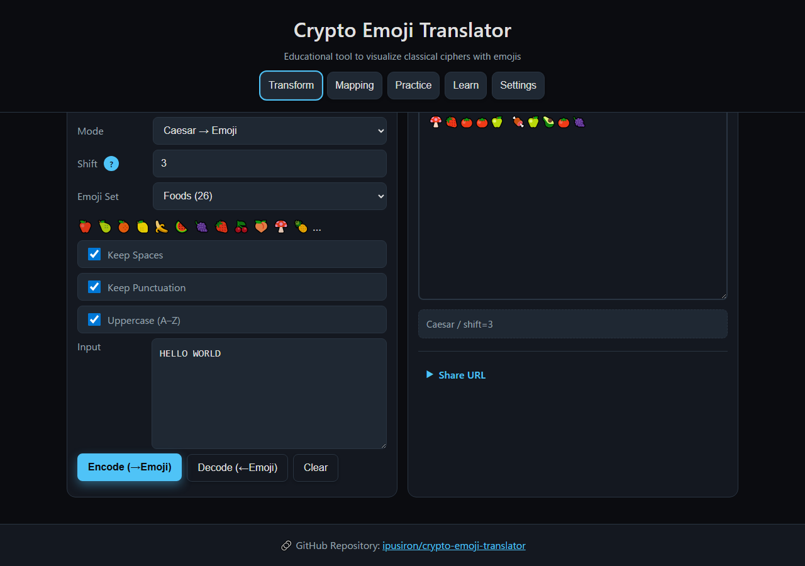
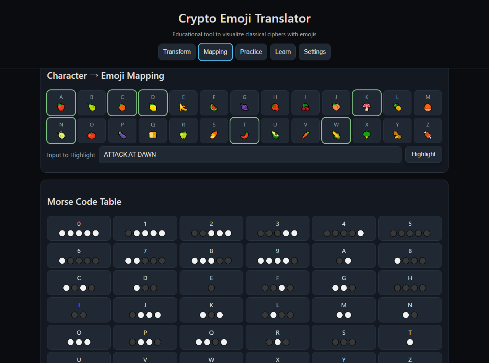
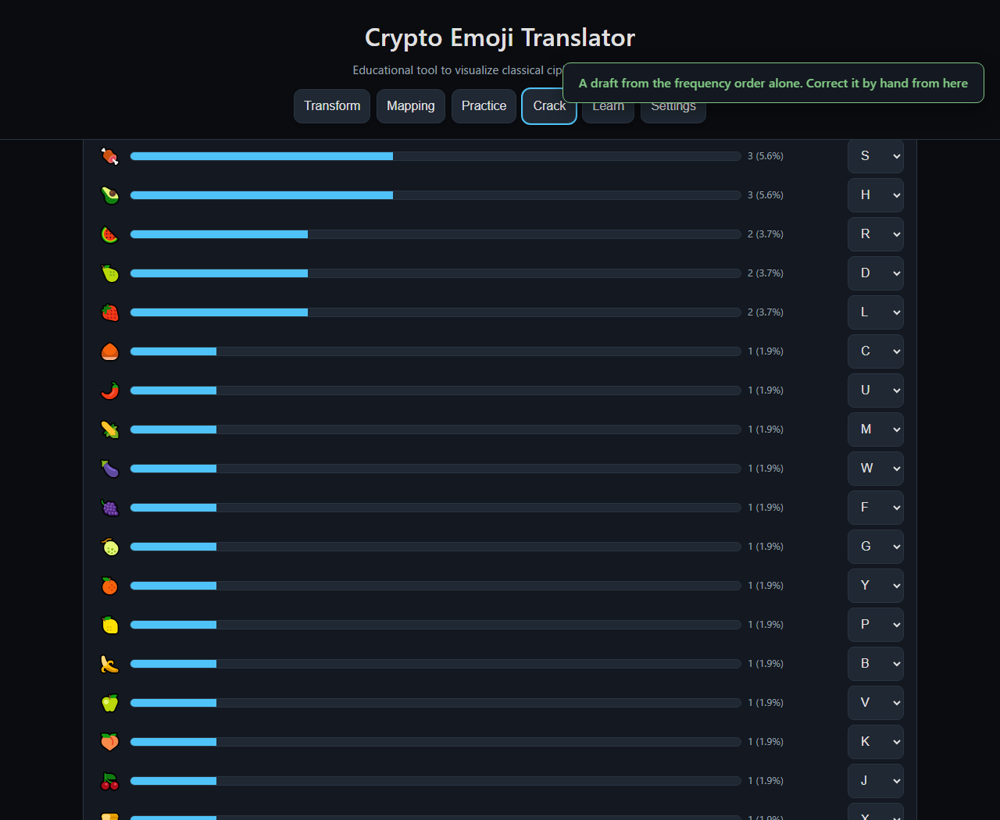
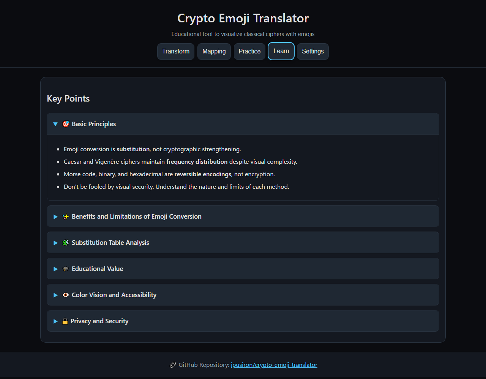
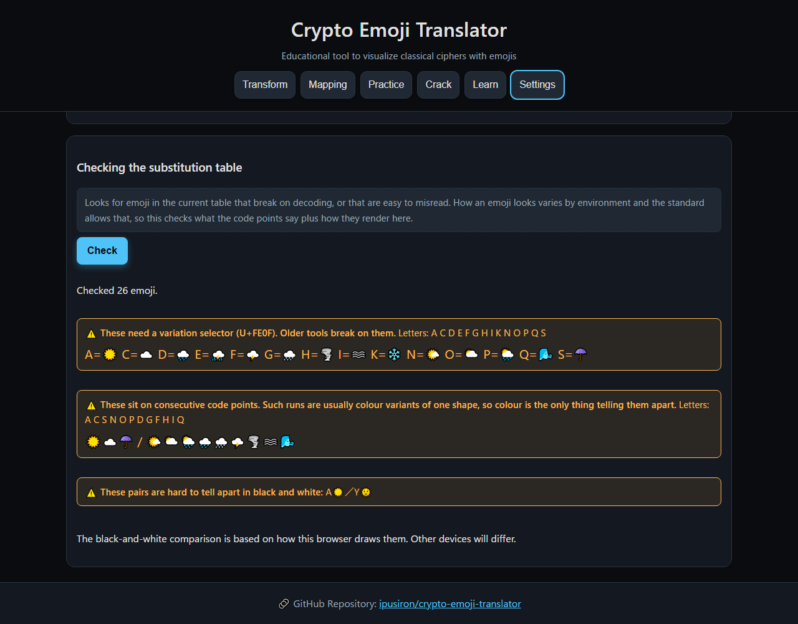

English · [日本語](README.md)

# Crypto Emoji Translator - classical ciphers shown as emoji


[](https://ipusiron.github.io/crypto-emoji-translator/)

**Day076 - 100 Security Tools with Generative AI**

**Crypto Emoji Translator** turns classical ciphers and encodings into strings of emoji, so you can watch what changes and what does not.

The Caesar and Vigenère ciphers map A–Z onto 26 emoji; Morse, binary and hex encode the bytes themselves. The point of the tool is the second half: **the emoji make it look harder, and change nothing about how hard it is.**

---

## 🌐 Demo

👉 **[https://ipusiron.github.io/crypto-emoji-translator/](https://ipusiron.github.io/crypto-emoji-translator/)**

Runs entirely in your browser.

---

## 📸 Screenshots

>
>*Transform tab, encoding "HELLO WORLD" with a Caesar shift of 3*

>
>*Visualizer tab, the A–Z mapping with the typed letters highlighted. The Morse table uses ⚫⚪*

>
>*Practice tab. Switch the direction and work through questions; accuracy and average time are kept*

>
>*Study tab, explaining that emoji add no strength, and what colour costs people who cannot see it*

>
>*Settings tab. Assign any emoji to A–Z and move the mapping in and out as JSON*

---

## 🎨 What emoji buy you, and what they do not

- **Camouflage by appearance**
  - A string of emoji may not read as ciphertext at a glance.
  - To someone unfamiliar with ciphers it "looks complicated", which raises the psychological barrier.

- **More work for the attacker**
  - The actual strength is unchanged, but an attacker first has to substitute the emoji back into letters.
  - That is a one-off cost, and only that.

- **Hard for people to tell apart**
  - There are many emoji, and similar shapes and colours are hard for a person to distinguish.
  - **For people with colour vision deficiency, colour-based distinctions may not exist at all.**
  - None of this applies to a computer: machine processing separates them easily, so no security is gained.

- **Easier to read, for certain purposes**
  - Morse code and binary are monotonous: just dots and dashes, just 0 and 1.
  - Emoji make the structure easier to follow, which helps as teaching material.

- **Compatibility and portability**
  - Emoji depend on the environment and the font; the same character looks different on different devices.
  - On old environments they may not render at all, so the message fails before anyone tries to read it.

- **More bytes**
  - An emoji takes several bytes in UTF-8, so the ciphertext is larger than the equivalent in letters.
  - Storage and transmission get less efficient.

- **Teaching value**
  - A cipher you can play with is easier to get people interested in.
  - It works as a way into frequency analysis, and into "do not trust how something looks".

---

## 🧩 Looking at it as a substitution table

Extending the Caesar cipher to emoji means using **two substitution tables in sequence**.

1. **The Caesar table**
   Shift each letter to another letter.
2. **The letter-to-emoji table**
   Map the shifted letter onto its emoji.

Combine them and you get "a Caesar cipher whose ciphertext alphabet happens to be emoji".
The strength is therefore the same as a plain Caesar cipher: **only the appearance has been diversified**.

---

### 🧮 The Caesar table (shift = 3)

| Plaintext | A | B | C | D | E | F | G | H | I | J | K | L | M | N | O | P | Q | R | S | T | U | V | W | X | Y | Z |
|------|---|---|---|---|---|---|---|---|---|---|---|---|---|---|---|---|---|---|---|---|---|---|---|---|---|---|
| Ciphertext | D | E | F | G | H | I | J | K | L | M | N | O | P | Q | R | S | T | U | V | W | X | Y | Z | A | B | C |
| As emoji | 🍋 | 🍌 | 🍉 | 🍇 | 🍓 | 🍒 | 🍑 | 🍄 | 🍍 | 🌰 | 🍈 | 🍅 | 🍆 | 🍞 | 🍏 | 🍠 | 🌶️ | 🥑 | 🥕 | 🌽 | 🥦 | 🥜 | 🍖 | 🍎 | 🍐 | 🍊 |

> The first row is the plaintext, the second the shifted letter, the third the ciphertext under the emoji table.
> In the tool, both the shift and the emoji set can be changed freely.

---

### 🧠 The ciphertext alphabet in polygraphic ciphers

- **The Playfair cipher**
  - Converts a pair of letters into another pair (the ciphertext is still letters).

- **Extensions such as the Porta cipher**
  - A design that maps a bigram onto a single symbol is possible.
  - That needs **26 × 26 = 676 ciphertext symbols**.

In that case there is no "encipher, then substitute" in two steps:
**one large table maps bigrams directly onto symbols**.

---

## ✨ What the tool does

### Modes

- **Caesar → emoji**: pick a shift (0–25) and encode or decode
- **Vigenère → emoji**: pick a key (letters) and encode or decode
- **Morse ↔ emoji**: ⚫ (dot) and ⚪ (dash), with ⏹ between letters and ⏸ between words. **The international and Wabun tables can be switched** (both directions)
- **Binary ↔ emoji**: the UTF-8 bytes in binary, as ⬜ (0) and ⬛ (1) (both directions)
- **Hex ↔ emoji**: the UTF-8 bytes in hex, as ⓿➊➋…🅕 (both directions)
- **Custom map**: build and save your own A–Z → 26 emoji mapping

### Everything else

- **The mapping table**: the letter-to-emoji mapping as a grid, with the typed letters highlighted
- **Practice**: random questions as a quiz, with statistics
- **Share by URL**: build a URL that carries the current settings
- **Custom map editor**: drag and drop to assign A–Z → emoji, with JSON in and out
- **Themes**: default (dark blue) / dark (pure black) / light
- **Two languages**: Japanese and English
- **Copy notices**: a toast when something is copied

---

## 🧾 Points of the specification

- **Everything happens in the browser.** Nothing is sent to a server.
- **A–Z only** for the ciphers (there is an option to upper-case the input).
- **Options**:
  - keep spaces / keep punctuation / upper-case
  - chunking (binary: 8, 4 or none; hex: 2 or none)
- **Storage**: the custom map is kept in localStorage; export it as JSON to move it between devices.
- **Responsive**: laid out for phones, tablets and desktops.

---

## 🎨 Emoji sets

Four preset sets are included, 26 emoji each.

| Set | What it is | First twelve |
|---------|------|---------------|
| **Foods** | Food | 🍎🍐🍊🍋🍌🍉🍇🍓🍒🍑🍄🍍 |
| **Shapes** | Shapes | 🔴🟠🟡🟢🔵🟣⚫⚪🟥🟧🟨🟩 |
| **Weather** | Weather | ☀️⛅☁️🌧️⛈️🌩️🌨️🌪️🌫️🌈❄️💧 |
| **Animals** | Animals | 🐭🐱🐶🐻🐼🐨🐯🦁🐷🐸🐵🐔 |

- Selecting a set previews its first twelve emoji.
- The sets are used by the Caesar and Vigenère modes.
- To add your own, append to `js/emoji-sets.js` (26 items, no duplicates — the tests enforce both).

---

## 🔗 URL parameters for sharing

The share button builds a URL carrying these parameters.

| Parameter | What it is | Example |
|------------|------|-------|
| `mode` | Mode | `caesar`, `vigenere`, `morse`, `binary`, `hex`, `custom` |
| `set` | Emoji set id | `foods`, `shapes`, `weather`, `animals` |
| `shift` | Caesar shift | `0`–`25` |
| `key` | Vigenère key | `LEMON` or any run of letters |
| `bchunk` | Binary chunking | `8`, `4`, `none` |
| `hchunk` | Hex chunking | `2`, `none` |
| `keepS` | Keep spaces | `1` (on) / `0` (off) |
| `keepP` | Keep punctuation | `1` (on) / `0` (off) |
| `up` | Upper-case | `1` (on) / `0` (off) |
| `in` | Input text | under 512 characters |

**Example**:
```
https://ipusiron.github.io/crypto-emoji-translator/?mode=caesar&set=foods&shift=3&keepS=1&keepP=1&up=1&in=HELLO
```

> A long `in` makes the URL unwieldy, so keep it under 512 characters.

---

## 🎓 What it teaches (limits included)

- **Something to look at**: follow the letter-to-emoji mapping on a grid. The visualizer tab colours the cells your input lands on.
- **A way into frequency analysis**: the Caesar and Vigenère ciphers change how the text looks, but **the frequency distribution survives**. The statistics are still the plaintext's.
- **Encoding is not concealment**: Morse, binary and hex are **encodings**. There is no key, so anyone who knows the rule can read them.
- **Where the strength is**: turning text into emoji does not make the cipher stronger. It is a change of representation.
- **A social point**: practice not trusting something because it "looks safe".

---

## ♿️ Accessibility

- Emoji in the mapping table carry an `aria-label` with the original letter
- Text reaches **4.5:1 against its background in all three themes** (computed from the WCAG 2.2 relative luminance; `test/contrast.test.js` checks it)
- Inputs are 16px, buttons 44px, checkboxes 20px, the help icon 24px
- Tabs move with the arrow keys, Home and End
- The help icon is a `button`, so its explanation is reachable by keyboard
- **Assigning a custom map is drag-and-drop only and cannot be done from the keyboard.** JSON import is the alternative

---

## 🔒 Privacy

- Your input is **never sent anywhere** (everything runs in the browser).
- The custom map lives in **localStorage**, on your device only.
- Sharing by URL is up to you. If you include `in`, your input is visible in the URL.

---

## ⚠️ Limits and things to know

- **Only A–Z is enciphered.** Japanese, digits and punctuation pass through unchanged (in the Caesar and Vigenère modes). Binary and hex work on the UTF-8 bytes, so they handle any text.
- Very long input makes the browser work hard (roughly 5,000 characters).
- **The same emoji looks different on different devices and fonts.** The standard allows this (UTS #51: "The shape of the character can vary significantly"). What carries the information is the sequence of code points, not the picture, so decoding is unaffected.
- **ZWJ sequences (👨‍👩‍👧 and the like) are not used in the tables.** `👨‍👩‍👧` (one character to a reader) and `👨👩👧` (three) would produce the same symbol string, so **the reverse direction would not be unique**.
- **Morse covers both the international table (ITU-R M.1677-1, 50 entries) and Wabun (別表第一号 of the Japanese radio regulations, 65 entries).** **44 codes mean different things in the two**, so the original text is not recoverable unless you say which table to read with. The multiplication sign is not in the table because ITU says to send X for it, and the procedural signals (Understood, Error and the rest) are left out because they have no character and some collide with letters. Characters outside the table are dropped, but **the screen says so**.

---

## 🗺️ Using the custom map

Assign any emoji to each of A–Z and build a substitution table of your own.
Share a rule within a group, or use it as teaching material and learn how substitution works by playing with it.

---

### 👁️ A note on colour vision

- The tool uses the colour and shape of emoji for learning, but **people with colour vision deficiency may not be able to tell them apart by colour**.
- When colour is used for teaching, always pair it with **another cue: shape, a label, a border**.
- The same applies when building a custom map: lean on **features other than colour** (animals vs fruit, the shape of the icon, a numbered label).
- This is not a question of cipher strength. It is **a UI and human-factors risk**, and the fact that an attacker can exploit it is worth discussing too.

> For example, red = danger / green = safe cannot be read by everyone, and an attacker can exploit that to mislead.

---

## 🎯 Use cases

### Learning about security

- Follow the Caesar and Vigenère ciphers in an unfamiliar alphabet. Put the result next to the mapping table and see that **the frequency distribution does not change**
- Compare encoding (Morse, binary, hex) with enciphering on the same screen. The former has no key, so the rule is the whole secret
- When a CTF or a puzzle hands you emoji ciphertext, use this to build the substitution table by hand

### Teaching and self-study

- In a class or workshop, show the ordinary letter substitution and the emoji substitution side by side: "it looks louder, it is exactly as strong"
- Use the practice tab, switching the direction (text → emoji, emoji → text). Accuracy and average time are kept
- **Use it as material on colour and accessibility.** A design that leans on colour alone can be shown failing, with something concrete in front of you

### Work

- In training on how information gets hidden, show something that reads as emoji but is not
- Check the output of your own substitution or encoding routine against this tool
- **Use it as material on the sharp edges of Unicode.** Emoji carrying a variation selector (U+FE0F) or a ZWJ break when split by code point — this tool itself had that bug

### Hobby and fiction

- Build your own table with the custom map and exchange messages within a group
- Build a puzzle for an event and check the answer
- Work out a cipher for a novel or a game in a form that actually runs

### With other tools

- [Frequency Analyzer](https://ipusiron.github.io/frequency-analyzer/) (Day009): look at the letter frequencies of the extracted text
- [Caesar Cipher Breaker](https://ipusiron.github.io/caesar-cipher-breaker/) (Day008): put the letters back and run through every shift

### Limits

- **This is a tool for learning. It cannot keep a secret.** Anyone who has the table can read it, and anyone without it can use frequency analysis
- Emoji do not make a cipher stronger. **Only the appearance changes**
- Because emoji look different on different devices, take care when handing the output around as print or as an image

---

## 🧪 Tests

```bash
npm test
```

- Runs on Node.js 22 or later. There are no dependencies (only `node --test` is used)
- GitHub Actions runs them on every push and pull request
- What they cover: grapheme splitting (emoji with a variation selector must not split), round trips for every mode and every emoji set, the Morse table against ITU-R M.1677-1, the two dictionaries against the screen, contrast ratios in all three themes, the ARIA references, and the contents of the meta CSP

---

## 💻 Requirements

- A modern browser (the current Chrome, Edge, Firefox or Safari)
- **To open it locally, just open `index.html` in a browser.** Every file it loads sits in the same folder
- Grapheme splitting uses `Intl.Segmenter` (Chrome 87, Safari 14.1, **Firefox 125, 2024-04-16** and later). Where it is missing, a simpler splitter takes over
- To run the tests, Node.js 22 or later is needed

---

## 🗂️ Directory structure

```
crypto-emoji-translator/
├── index.html              # the screen (five tabs)
├── css/                    # stylesheet
│   └── style.css           # colours (three themes) and layout, including narrow screens
├── js/                     # scripts
│   ├── main.js             # the screen side (reading input, display, tabs, practice, sharing)
│   ├── i18n.js             # the two dictionaries and the swap
│   ├── custommap.js        # the custom map editor (assignment, JSON in and out)
│   ├── graphemes.js        # splits a string into characters without breaking selectors or ZWJ
│   ├── emoji-sets.js       # the four emoji sets (Foods, Shapes, Weather, Animals)
│   └── modes/              # the calculation layer (no DOM)
│       ├── caesar.js       # Caesar cipher
│       ├── vigenere.js     # Vigenère cipher
│       ├── morse.js        # Morse code
│       ├── binaryhex.js    # binary and hex
│       ├── bytes.js        # byte mode (Base100: one UTF-8 byte, one emoji)
│       └── cryptanalysis.js # breaking it by hand (frequencies, cribs, likelihood)
├── test/                   # tests (run with node --test)
│   ├── load.js             # loads the same scripts the screen does, and builds the mapping
│   ├── core.test.js        # the calculation layer (splitting, round trips, the tables, the edges)
│   ├── html.test.js        # static checks on index.html and the screen-side scripts
│   ├── i18n.test.js        # the two dictionaries against the wording on screen
│   ├── contrast.test.js    # contrast ratios, target sizes, ARIA, meta CSP
│   └── readme.test.js      # the README against the implementation
├── .github/                # GitHub settings
│   └── workflows/          # GitHub Actions workflows
│       └── test.yml        # runs npm test on push and pull request
├── assets/                 # images
│   ├── screenshot.png      # screenshot (transform tab)
│   ├── screenshot2.png     # screenshot (visualizer tab)
│   ├── screenshot3.png     # screenshot (practice tab)
│   ├── screenshot4.png     # screenshot (study tab)
│   ├── screenshot5.png     # screenshot (settings tab, custom map)
│   └── en/                 # screenshots of the English screen
│       ├── screenshot.png  # screenshot (transform tab)
│       ├── screenshot2.png # screenshot (visualizer tab)
│       ├── screenshot3.png # screenshot (practice tab)
│       ├── screenshot4.png # screenshot (study tab)
│       └── screenshot5.png # screenshot (settings tab, custom map)
├── package.json            # how the tests run (no dependencies)
├── _headers                # security headers for a host that reads them (GitHub Pages does not)
├── AGENTS.md               # notes for Codex
├── CLAUDE.md               # notes for Claude Code
├── LICENSE                 # MIT License
├── .gitignore              # what Git ignores
├── .nojekyll               # tells GitHub Pages not to use Jekyll
├── README.md               # the Japanese version
└── README.en.md            # this file
```

---

## 📄 License

MIT License – see [LICENSE](LICENSE) for details.

---

## 🛠️ About this tool

This tool was built as part of the "100 Security Tools with Generative AI" project.
The project builds and publishes a range of security-related tools over 100 days, with the help of AI.

For the project and the other tools, see the page below.

🔗 [https://akademeia.info/?page_id=42163](https://akademeia.info/?page_id=42163)
