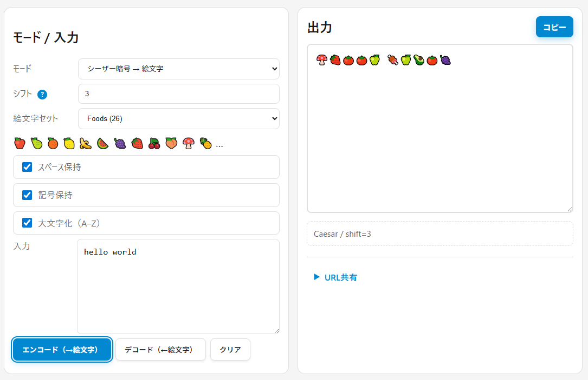

<!--
---
id: day076
slug: crypto-emoji-translator

title: "Crypto Emoji Translator"

subtitle_ja: "古典暗号や符号化を絵文字で可視化する教育ツール"
subtitle_en: "Educational tool to visualize classical ciphers with emojis"

description_ja: "シーザー暗号やヴィジュネル暗号、モールス符号、バイナリ/16進数をカラフルな絵文字列に変換。見た目は派手でも暗号の本質（頻度分布や可逆性）は変わらないことを体験的に理解できる教育向けWebツール。"
description_en: "Convert Caesar cipher, Vigenère cipher, Morse code, and binary/hex encodings into colorful emoji sequences. An educational web tool demonstrating that visual complexity doesn't improve cryptographic strength - frequency distributions and reversibility remain unchanged."

category_ja:
  - 古典暗号
  - 換字式暗号
  - 符号化
category_en:
  - Classical Cryptography
  - Subsutition Cipher
  - Encoding

difficulty: 1

tags:
  - emoji
  - cipher
  - caesar
  - vigenere
  - morse
  - binary
  - hex
  - education
  - client-side

repo_url: "https://github.com/ipusiron/crypto-emoji-translator"
demo_url: "https://ipusiron.github.io/crypto-emoji-translator/"

hub: true
---
-->

# Crypto Emoji Translator - 絵文字暗号変換ツール


[](https://ipusiron.github.io/crypto-emoji-translator/)

**Day076 - 生成AIで作るセキュリティツール100**

**Crypto Emoji Translator**は、古典暗号文やエンコード後の文字列をカラフルな**絵文字列**へ置換する、教育向けのWebツールです。

見た目は派手でも暗号の本質（**頻度分布**や**可逆性**）は変わらないことを体験的に理解できます。

シーザー暗号、ヴィジュネル暗号、モールス符号、バイナリ変換、16進数への変換に対応しています。

---

## 🌐 デモページ

👉 **[https://ipusiron.github.io/crypto-emoji-translator/](https://ipusiron.github.io/crypto-emoji-translator/)**

ブラウザーで直接お試しいただけます。

---

## 📸 スクリーンショット

>
>*絵文字のシーザー暗号文*

---

## 🎨 絵文字変換の効能と限界

- **見た目によるカモフラージュ**  
  - 絵文字列は、一見すると暗号文だと気づかれない可能性がある。  
  - 暗号に詳しくない人にとっては「複雑そうに見える」ため、心理的ハードルが上がる。  

- **解読作業の手間増加**  
  - 実際の解読強度は変わらないが、攻撃者はまず「絵文字をアルファベットなど扱いやすい記号に置換する」前処理が必要となる。  
  - その分だけ余計な手間がかかる。  

- **人間にとっての識別困難性**  
  - 絵文字は数が多く、類似した形や色合いのものを区別するのは人間にとって難しい。  
  - **特に色覚異常のある人にとっては、色合いが区別できず識別困難がさらに増す。**  
  - この点はコンピューターには関係なく、機械処理なら区別は容易であり、セキュリティ強度は増さない。  

- **視認性の向上（特定の用途）**  
  - モールス信号やバイナリ列のように「点と線」「0と1」だけの表現は単調で読みにくい。  
  - 絵文字を用いることで視認性や学習効果が向上し、学習教材として有効になる。  

- **互換性・可搬性の制約**  
  - 絵文字は環境やフォントに依存し、端末によって見た目が異なることがある。  
  - 古い環境では文字化けし、解読以前に正しく伝達できないリスクがある。  

- **冗長性の増加**  
  - UTF-8で絵文字は数バイトを占めるため、通常のアルファベット暗号文よりデータサイズが大きくなる。  
  - 保存や転送の効率は悪化する。  

- **教育的効果**  
  - 暗号を「遊び」として直感的に体験できるため、学習者の関心を引きやすい。  
  - 頻度解析や「見た目に騙される危険性」を説明する教材として効果的。  

---

## 🧩 置換表の観点で考察する

シーザー暗号を絵文字に拡張して考えると、実際には次の **二段階の置換表** を用いていることになります。  

1. **シーザー暗号の置換表**  
   アルファベットをシフトして別のアルファベットに対応づける。  
2. **アルファベットと絵文字の置換表**  
   シフト後のアルファベットを、対応する絵文字に割り当てる。  

これを組み合わせると、「暗号文の文字体系をアルファベットから絵文字に置き換えたシーザー暗号」になります。  
したがって暗号強度自体は従来のシーザー暗号と変わらず、**見た目が多様化して難しく見えるだけ**です。  

---

### 🧮 シーザー暗号の置換表（例：シフト=3）

| 平文 | A | B | C | D | E | F | G | H | I | J | K | L | M | N | O | P | Q | R | S | T | U | V | W | X | Y | Z |
|------|---|---|---|---|---|---|---|---|---|---|---|---|---|---|---|---|---|---|---|---|---|---|---|---|---|---|
| 暗号 | D | E | F | G | H | I | J | K | L | M | N | O | P | Q | R | S | T | U | V | W | X | Y | Z | A | B | C |
| 絵文字例 | 🍋 | 🍌 | 🍉 | 🍇 | 🍓 | 🍒 | 🍑 | 🍄 | 🍍 | 🌰 | 🍈 | 🍅 | 🍆 | 🍞 | 🍏 | 🍠 | 🌶️ | 🥑 | 🥕 | 🌽 | 🥦 | 🥜 | 🍖 | 🍎 | 🍐 | 🍊 |

> 上段が平文、2段目がシフト後のアルファベット、3段目が「絵文字置換表」による暗号文。  
> 実際にはシフト量や絵文字セットを自由に切り替えられる。  

---

### 🧠 多文字換字式暗号における暗号文文字体系

- **プレイフェア暗号**  
  - 2文字ペアを別の2文字ペアに変換（暗号文は依然としてアルファベット）。  

- **ポルタ暗号などの拡張例**  
  - 2文字（ビグラム）を1記号に変換する設計も可能。  
  - 必要な暗号文記号は **26×26＝676種類** にのぼる。  

この場合は「暗号化 → 置換」という二段階ではなく、  
**大規模な置換表を用いて、直接ビグラム→記号に対応づける**仕組みになります。

---

## ✨ 本ツールの主な機能

### 変換モード

- **シーザー暗号 → 絵文字**：シフト値（0～25）を指定して絵文字に変換／復号
- **ヴィジュネル暗号 → 絵文字**：鍵文字列（英字）を指定して絵文字に変換／復号
- **モールス符号 ↔ 絵文字**：⚫⚪で符号化し、⏹⏸で区切り（双方向変換）
- **バイナリ ↔ 絵文字**：文字コードを2進数化して絵文字変換（双方向変換）
- **16進数 ↔ 絵文字**：文字コードを16進数化して絵文字変換（双方向変換）
- **カスタムマップ**：任意のA–Z → 26絵文字のマッピングを自作・保存

### その他の機能

- **対応表の可視化**：「文字→絵文字」の対応をグリッド表示、ハイライト機能付き
- **練習モード**：ランダム出題でクイズ形式の学習、統計表示
- **URL共有機能**：現在の設定を含むURLを生成してシェア
- **カスタムマップエディター**：ドラッグ&ドロップでA–Z → 絵文字を割り当て、JSON入出力対応
- **テーマ設定**：デフォルト（ダークブルー）／ダークモード（純黒）／ライトモード
- **多言語対応**：「日本語／English」切り替え
- **コピー通知**：クリップボードコピー時のトースト表示  

---

## 🧾 仕様のポイント

- **完全クライアントサイド処理**：入力はすべてブラウザー内で処理し、サーバー送信は行いません。
- **対象文字**：A–Zのみを対象に変換（小文字は大文字化オプションあり）。
- **オプション機能**：
  - スペース保持／記号保持／大文字化の切り替え
  - バイナリ・16進数のチャンク区切り設定（8/4/2桁、なし）
- **データ保存**：カスタムマップはlocalStorageに保存され、端末間共有はJSONエクスポートで対応。
- **レスポンシブ対応**：モバイル・タブレット・デスクトップに最適化。  

---

## 🎨 絵文字セット

本ツールには4つのプリセット絵文字セットが用意されています（各26種類）：

| セット名 | 説明 | 先頭の絵文字例 |
|---------|------|---------------|
| **Foods** | 食べ物 | 🍎🍐🍊🍋🍌🍉🍇🍓🍒🍑🍄🍍 |
| **Shapes** | 図形 | 🔴🟠🟡🟢🔵🟣⚫⚪🟥🟧🟨🟩 |
| **Weather** | 天気 | ☀️⛅☁️🌧️⛈️🌩️🌨️🌪️🌫️🌈❄️💧 |
| **Animals** | 動物 | 🐭🐱🐶🐻🐼🐨🐯🦁🐷🐸🐵🐔 |

- セット選択時は先頭12個がプレビュー表示されます。
- シーザー暗号・ヴィジュネル暗号モードで使用できます。
- 必要に応じて `data/emoji_sets.json` を編集して独自セットを追加可能。

---

## 🔗 共有用URLパラメーター

共有URL生成機能により、以下のパラメーターを含むURLを作成できます：

| パラメーター | 説明 | 値の例 |
|------------|------|-------|
| `mode` | 変換モード | `caesar`, `vigenere`, `morse`, `binary`, `hex`, `custom` |
| `set` | 絵文字セットID | `foods`, `shapes`, `weather`, `animals` |
| `shift` | シーザー暗号のシフト値 | `0`～`25` |
| `key` | ヴィジュネル暗号の鍵 | `LEMON` など英字文字列 |
| `bchunk` | バイナリのチャンク区切り | `8`, `4`, `none` |
| `hchunk` | 16進数のチャンク区切り | `2`, `none` |
| `keepS` | スペース保持 | `1`（ON）/ `0`（OFF） |
| `keepP` | 記号保持 | `1`（ON）/ `0`（OFF） |
| `up` | 大文字化 | `1`（ON）/ `0`（OFF） |
| `in` | 入力テキスト（URLエンコード済み） | 512文字未満推奨 |

**使用例**：
```
https://ipusiron.github.io/crypto-emoji-translator/?mode=caesar&set=foods&shift=3&keepS=1&keepP=1&up=1&in=HELLO
```

> ⚠️ 長文の `in` パラメーターはURL肥大化を招くため、512文字未満を推奨します。

---

## 🎓 教育的な有効性（限界を含む）

- **視覚的直感**：文字→絵文字の対応をグリッドで確認しつつ学べる。  
- **頻度解析の導入**：シーザー暗号とヴィジュネル暗号は見た目が変わっても**頻度分布**は残る。  
- **可逆性の理解**：モールス信号、バイナリ変換、16進数変換は**符号化**であり、**秘匿化ではない**。  
- **ソーシャル面の啓発**：「見た目が安全そう」に惑わされない目を養う。

---

## ♿️ アクセシビリティ

- 対応表の絵文字に **aria-label（元文字）** を付与  
- ハイコントラスト枠／文字サイズ調整  
- すべての操作はキーボードでも利用可能（入力→ボタン実行）

---

## 🔒 プライバシー

- 入力データは**送信しません**（完全クライアントサイド）。  
- カスタムマップ（Custom Map）は **localStorage** に保存（端末内のみ）。  
- 共有URLは任意。`in` を含めると第三者に入力が見えるため注意。

---

## ⚠️ 制約と既知の注意点

- 長大な入力はブラウザー負荷が高まります（目安：5,000文字）。  
- 一部のフォント環境で絵文字幅が揃わない場合があります。  
- ZWJ/合字系の絵文字は復号の曖昧さが増すため採用していません。

---

## 🧪 教育的な有効性

- **視覚的直感**：文字→絵文字の対応表を見ながら暗号処理を追える。  
- **頻度解析への導入**：見た目が派手でも統計パターンは変わらないことを体感。  
- **安全性の限界を理解**：絵文字化は暗号の強度を上げるわけではなく、単なる表現変換であることを学べる。

---

## 🗺️ カスタムマップの活用

利用者は「A–Z」の各文字に任意の絵文字を割り当てて、自分だけの置換表を作成できます。
これにより、仲間内で独自の暗号化ルールを共有したり、学習教材として遊びながら暗号の仕組みを理解できます。  

---

### 👁️ 注意（色覚異常）

- 本ツールは絵文字の色合いや形状を学習用途で利用しますが、**色覚異常のある方は色での識別が難しい場合があります**。  
- 教育目的で色を用いる場合は、必ず **形・ラベル・枠線などの代替手段** を組み合わせることが重要です。  
- 本ツールのカスタムマップ作成時にも、**色以外の特徴（例：動物 vs 果物、アイコンの形状、番号ラベル）** を併用することを推奨します。  
- これは暗号強度の問題ではなく、**UI設計やヒューマンファクターのリスク**であり、攻撃者に悪用され得る点も教育的に考察できます。  

> 例：赤＝危険／緑＝安全 といった色分けは、色覚異常者には判別困難であり、攻撃者が偽装することで誤認を誘発できる。

---

## 🚀 活用シナリオ例

- **授業やワークショップでの体験学習**  
  学習者にシーザー暗号を説明する際、通常のアルファベット置換に加えて絵文字置換を利用することで、  
  「見た目は派手でも暗号強度は同じ」という点を直感的に理解させられる。  

- **仲間内での遊び感覚の暗号メッセージ交換**  
  カスタムマップを作成し、独自の絵文字暗号ルールを決めてメッセージを交換する。  
  暗号解読ゲームや文化祭・サークル活動の題材として盛り上げやすい。  

- **ヒューマンファクターの教材としての利用**  
  色覚異常の人にとって識別が難しいケースを再現し、  
  「見た目に依存した設計が攻撃者に悪用されるリスク」を学習者に体感させる。  
  UI設計とセキュリティの関係を議論する題材に適している。  

---

## 🗂️ ディレクトリー構造

```
crypto-emoji-translator/
├── index.html             # メインHTML
├── css/
│   └── style.css          # スタイルシート（テーマ、レスポンシブ対応）
├── js/
│   ├── main.js            # メインコントローラー（状態管理、UI制御）
│   ├── i18n.js            # 多言語対応（日本語/English）
│   ├── custommap.js       # カスタムマップエディター
│   └── modes/             # 暗号化・符号化モジュール
│       ├── caesar.js      # シーザー暗号
│       ├── vigenere.js    # ヴィジュネル暗号
│       ├── morse.js       # モールス符号
│       └── binaryhex.js   # バイナリ・16進数
├── data/
│   └── emoji_sets.json    # 絵文字セット定義（Foods, Shapes, Weather, Animals）
├── assets/
│   └── screenshot.png     # デモ用スクリーンショット
├── README.md              # 本ファイル
├── CLAUDE.md              # Claude Code用プロジェクト指示
└── LICENSE                # MITライセンス
```

---

## 📄 ライセンス

MIT License – 詳細は [LICENSE](LICENSE) を参照してください。

---

## 🛠️ このツールについて

本ツールは、「生成AIで作るセキュリティツール100」プロジェクトの一環として開発されました。
このプロジェクトでは、AIの支援を活用しながら、セキュリティに関連するさまざまなツールを100日間にわたり制作・公開していく取り組みを行っています。

プロジェクトの詳細や他のツールについては、以下のページをご覧ください。

🔗 [https://akademeia.info/?page_id=42163](https://akademeia.info/?page_id=42163)
