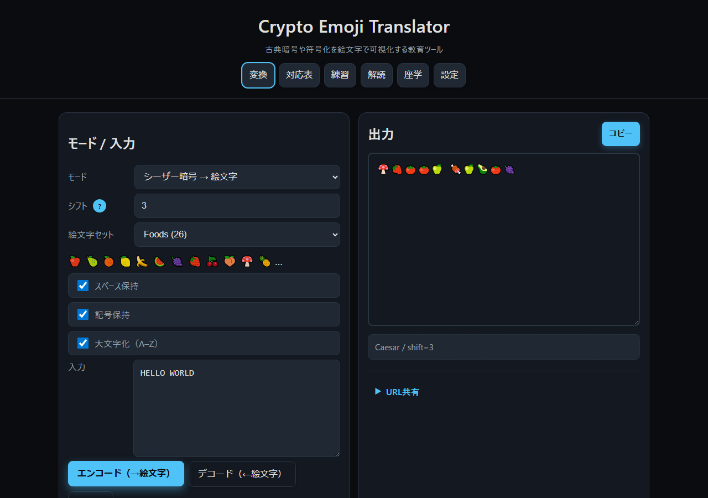
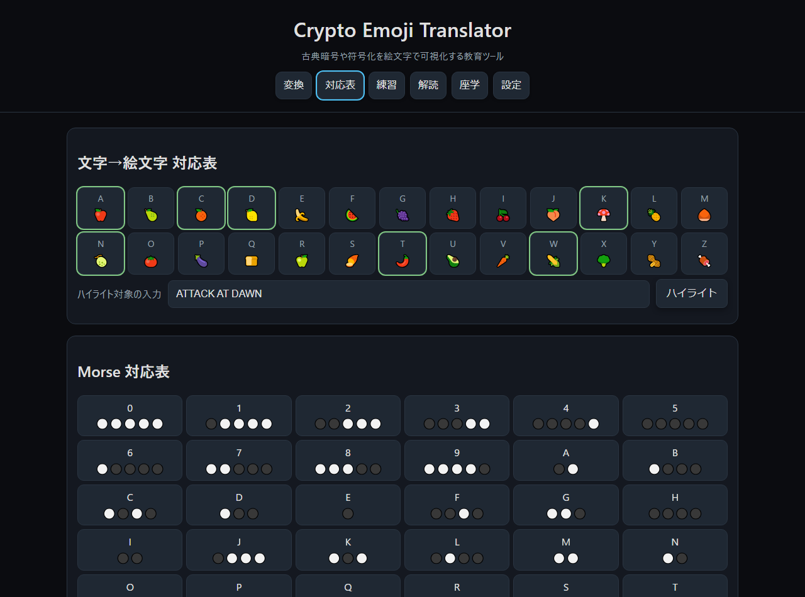
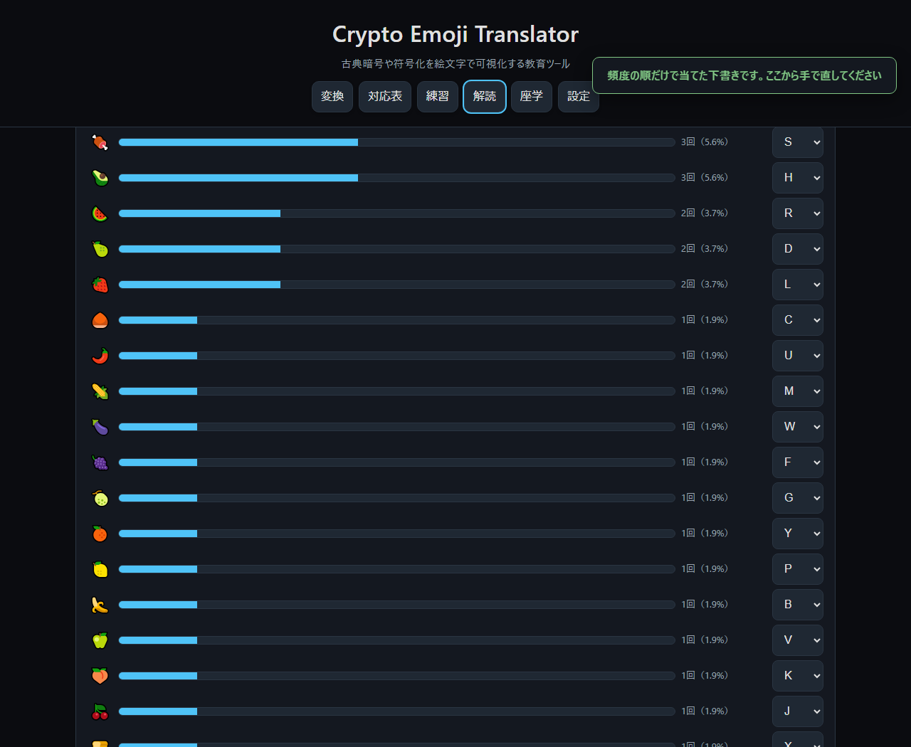
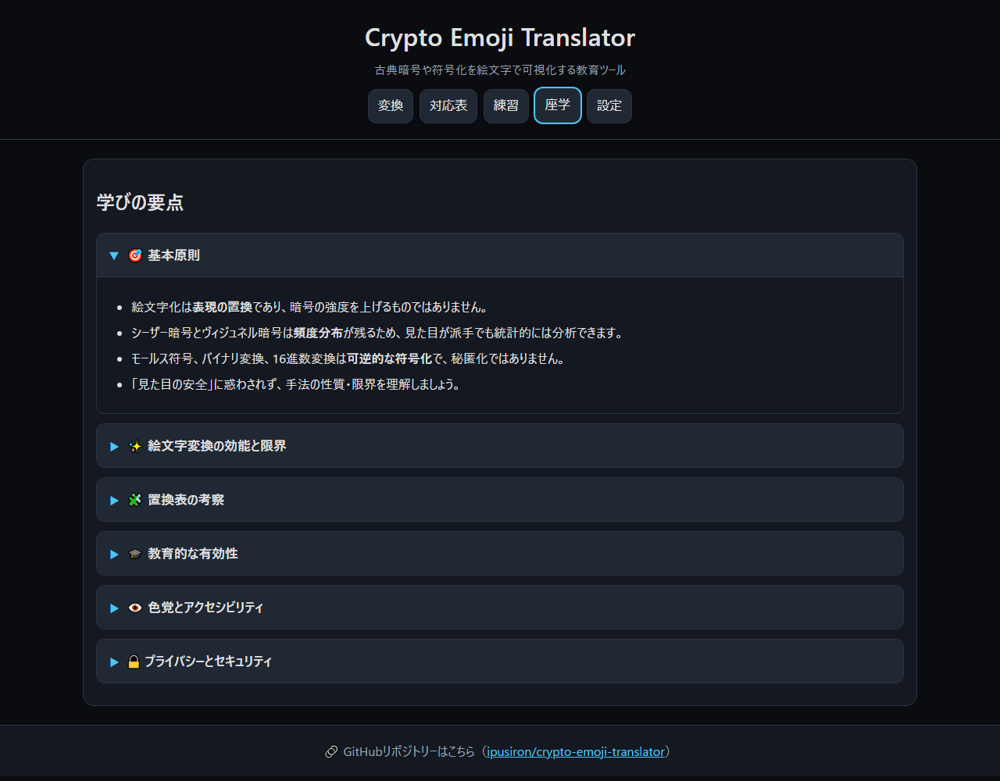
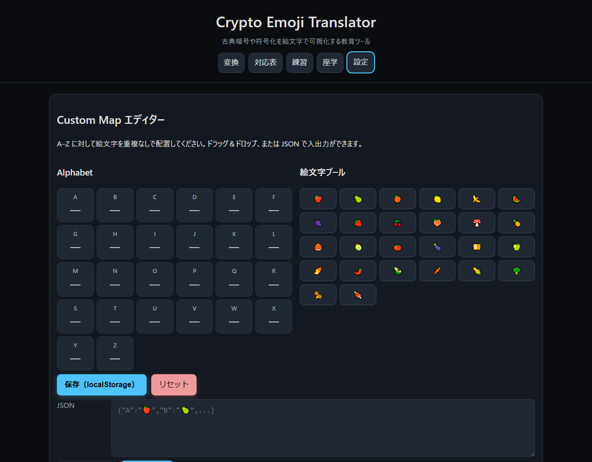
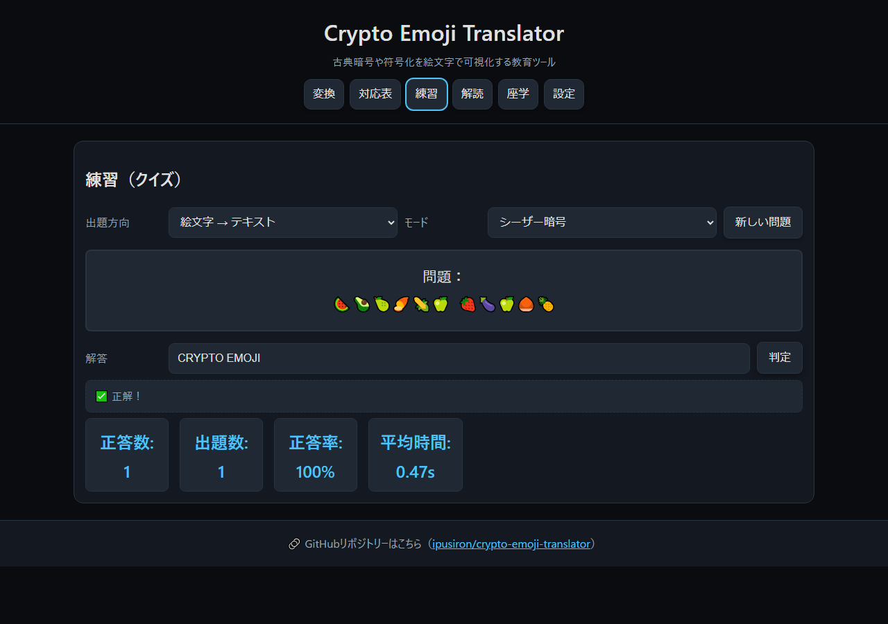

<!--
---
id: day076
slug: crypto-emoji-translator

title: "Crypto Emoji Translator"

subtitle_ja: "古典暗号や符号化を絵文字で可視化する教育ツール"
subtitle_en: "Educational tool to visualize classical ciphers with emojis"

description_ja: "シーザー暗号やヴィジュネル暗号、モールス符号、バイナリ/16進数をカラフルな絵文字列に変換。見た目は派手でも暗号の本質（頻度分布や可逆性）は変わらないことを体験的に理解できる教育向けWebツール。"
description_en: "Convert Caesar cipher, Vigenère cipher, Morse code, and binary/hex encodings into colorful emoji sequences. An educational web tool demonstrating that visual complexity doesn't improve cryptographic strength - frequency distributions and reversibility remain unchanged."

category_ja:
  - 古典暗号
  - 換字式暗号
  - 符号化
category_en:
  - Classical Cryptography
  - Substitution Cipher
  - Encoding

difficulty: 1

tags:
  - emoji
  - cipher
  - caesar
  - vigenere
  - morse
  - binary
  - hex
  - education
  - client-side

repo_url: "https://github.com/ipusiron/crypto-emoji-translator"
demo_url: "https://ipusiron.github.io/crypto-emoji-translator/"

hub: true
---
-->

# Crypto Emoji Translator - 絵文字暗号変換ツール


[](https://ipusiron.github.io/crypto-emoji-translator/)

**Day076 - 生成AIで作るセキュリティツール100**

[English](README.en.md) · 日本語

**Crypto Emoji Translator**は、古典暗号文やエンコード後の文字列をカラフルな**絵文字列**へ置換する、教育向けのWebツールです。

見た目は派手でも暗号の本質（**頻度分布**や**可逆性**）は変わらないことを体験的に理解できます。

シーザー暗号、ヴィジュネル暗号、モールス符号、バイナリ変換、16進数への変換に対応しています。

---

## 🌐 デモページ

👉 **[https://ipusiron.github.io/crypto-emoji-translator/](https://ipusiron.github.io/crypto-emoji-translator/)**

ブラウザーで直接お試しいただけます。

---

## 📸 スクリーンショット

>
>*変換タブ。シーザー暗号（シフト3）で「HELLO WORLD」を絵文字にしたところ*

>
>*対応表タブ。A–Zと絵文字の対応と、入力した文字のハイライト。モールス対応表も⚫⚪で示す*

>
>*解読タブ。絵文字の出現頻度から当てていき、クリブで裏を取る。既存の換字解読ツールは絵文字を受け付けない*

>
>*解読タブ。絵文字1つに見える文字列から、仕込まれた文章を取り出したところ*

>
>*設定タブ。weatherセットを点検すると、このツールが実際に壊れていた14文字がそのまま挙がる*

>
>*練習タブ。出題方向を切り替えてクイズを解く。正答率と平均時間が残る*

---


---

## 🎨 絵文字変換の効能と限界

- **見た目によるカモフラージュ**  
  - 絵文字列は、一見すると暗号文だと気づかれない可能性がある。  
  - 暗号に詳しくない人にとっては「複雑そうに見える」ため、心理的ハードルが上がる。  

- **解読作業の手間増加**  
  - 実際の解読強度は変わらないが、攻撃者はまず「絵文字をアルファベットなど扱いやすい記号に置換する」前処理が必要となる。  
  - その分だけ余計な手間がかかる。  

- **人間にとっての識別困難性**  
  - 絵文字は数が多く、類似した形や色合いのものを区別するのは人間にとって難しい。  
  - **特に色覚異常のある人にとっては、色合いが区別できず識別困難がさらに増す。**  
  - この点はコンピューターには関係なく、機械処理なら区別は容易であり、セキュリティ強度は増さない。  

- **視認性の向上（特定の用途）**  
  - モールス符号やバイナリ列のように「点と線」「0と1」だけの表現は単調で読みにくい。  
  - 絵文字を用いることで視認性や学習効果が向上し、学習教材として有効になる。  

- **互換性・可搬性の制約**  
  - 絵文字は環境やフォントに依存し、端末によって見た目が異なることがある。  
  - 古い環境では文字化けし、解読以前に正しく伝達できないリスクがある。  

- **冗長性の増加**  
  - UTF-8で絵文字は数バイトを占めるため、通常のアルファベット暗号文よりデータサイズが大きくなる。  
  - 保存や転送の効率は悪化する。  

- **教育的効果**  
  - 暗号を「遊び」として直感的に体験できるため、学習者の関心を引きやすい。  
  - 頻度解析や「見た目に騙される危険性」を説明する教材として効果的。  

---

## 🧩 置換表の観点で考察する

シーザー暗号を絵文字に拡張して考えると、実際には次の **二段階の置換表** を用いていることになります。  

1. **シーザー暗号の置換表**  
   アルファベットをシフトして別のアルファベットに対応づける。  
2. **アルファベットと絵文字の置換表**  
   シフト後のアルファベットを、対応する絵文字に割り当てる。  

これを組み合わせると、「暗号文の文字体系をアルファベットから絵文字に置き換えたシーザー暗号」になります。  
したがって暗号強度自体は従来のシーザー暗号と変わらず、**見た目が多様化して難しく見えるだけ**です。  

---

### 🧮 シーザー暗号の置換表（例：シフト=3）

| 平文 | A | B | C | D | E | F | G | H | I | J | K | L | M | N | O | P | Q | R | S | T | U | V | W | X | Y | Z |
|------|---|---|---|---|---|---|---|---|---|---|---|---|---|---|---|---|---|---|---|---|---|---|---|---|---|---|
| 暗号 | D | E | F | G | H | I | J | K | L | M | N | O | P | Q | R | S | T | U | V | W | X | Y | Z | A | B | C |
| 絵文字例 | 🍋 | 🍌 | 🍉 | 🍇 | 🍓 | 🍒 | 🍑 | 🍄 | 🍍 | 🌰 | 🍈 | 🍅 | 🍆 | 🍞 | 🍏 | 🍠 | 🌶️ | 🥑 | 🥕 | 🌽 | 🥦 | 🥜 | 🍖 | 🍎 | 🍐 | 🍊 |

> 上段が平文、2段目がシフト後のアルファベット、3段目が「絵文字置換表」による暗号文。  
> 実際にはシフト量や絵文字セットを自由に切り替えられる。  

---

### 🧠 多文字換字式暗号における暗号文文字体系

- **プレイフェア暗号**  
  - 2文字ペアを別の2文字ペアに変換（暗号文は依然としてアルファベット）。  

- **ポルタ暗号などの拡張例**  
  - 2文字（ビグラム）を1記号に変換する設計も可能。  
  - 必要な暗号文記号は **26×26＝676種類** にのぼる。  

この場合は「暗号化 → 置換」という二段階ではなく、  
**大規模な置換表を用いて、直接ビグラム→記号に対応づける**仕組みになります。

---

## ✨ 本ツールの主な機能

### 変換モード

- **シーザー暗号 → 絵文字**：シフト値（0～25）を指定して絵文字に変換／復号
- **ヴィジュネル暗号 → 絵文字**：鍵文字列（英字）を指定して絵文字に変換／復号
- **モールス符号 ↔ 絵文字**：⚫（短点）⚪（長点）で符号化し、⏹（文字の区切り）⏸（語の区切り）で分ける。**欧文と和文の符号表を切り替えられる**（双方向変換）
- **バイナリ ↔ 絵文字**：UTF-8のバイト列を2進数にして ⬜（0）⬛（1）に置き換える（双方向変換）
- **16進数 ↔ 絵文字**：UTF-8のバイト列を16進数にして ⓿➊➋…🅕 に置き換える（双方向変換）
- **バイト（Base100）↔ 絵文字**：UTF-8のバイト1つを絵文字1つに置き換える。256個の表を使うので、**日本語でも数字でも記号でも通る**。割り当ては Base100 と同じなので、dCode などと行き来できる（双方向変換）
- **カスタムマップ**：任意のA–Z → 26絵文字のマッピングを自作・保存

### その他の機能

- **解読演習**：鍵を知らずに読む。絵文字の出現頻度を棒で見せ、クリブ（分かっている語）を当てはめながら手で割り当てを決める。一意復号距離から「この長さなら解けるか」の目安も出す
- **置換表の点検**：いまの置換表に、復号で壊れる絵文字（1文字に分けられない・ZWJ・重複）や、読み違えやすい組（セレクターが要る・肌の色つき・コードポイントが続く）が入っていないかを調べる。**白黒にしたときに見分けがつきにくい組**も、この画面での字形から測って挙げる
- **見えない文字の検出**：異体字セレクターやゼロ幅文字が仕込まれていないかを調べ、仕込まれたバイト列を取り出して見せる。取り除くこともできる
- **対応表の可視化**：「文字→絵文字」の対応をグリッド表示、ハイライト機能付き
- **練習モード**：ランダム出題でクイズ形式の学習、統計表示
- **URL共有機能**：現在の設定を含むURLを生成してシェア
- **カスタムマップエディター**：ドラッグ&ドロップでA–Z → 絵文字を割り当て、JSON入出力対応
- **テーマ設定**：デフォルト（ダークブルー）／ダークモード（純黒）／ライトモード
- **多言語対応**：「日本語／English」切り替え
- **コピー通知**：クリップボードコピー時のトースト表示  

---

## 🧾 仕様のポイント

- **完全クライアントサイド処理**：入力はすべてブラウザー内で処理し、サーバー送信は行いません。
- **対象文字**：A–Zのみを対象に変換（小文字は大文字化オプションあり）。
- **オプション機能**：
  - スペース保持／記号保持／大文字化の切り替え
  - チャンク区切りの設定（バイナリは8桁・4桁・なし／16進数は2桁・なし）
- **データ保存**：カスタムマップはlocalStorageに保存され、端末間共有はJSONエクスポートで対応。
- **レスポンシブ対応**：モバイル・タブレット・デスクトップに最適化。  

---

## 🎨 絵文字セット

本ツールには5つのプリセット絵文字セットが用意されています（各26種類）：

| セット名 | 説明 | 先頭の絵文字例 |
|---------|------|---------------|
| **Foods** | 食べ物 | 🍎🍐🍊🍋🍌🍉🍇🍓🍒🍑🍄🍍 |
| **Shapes** | 図形 | 🔴🟠🟡🟢🔵🟣⚫⚪🟥🟧🟨🟩 |
| **Weather** | 天気 | ☀️⛅☁️🌧️⛈️🌩️🌨️🌪️🌫️🌈❄️💧 |
| **Animals** | 動物 | 🐭🐱🐶🐻🐼🐨🐯🦁🐷🐸🐵🐔 |
| **Distinct** | 見分けやすさで選んだもの | ⌛⚓⚡⚽⭐🌈🌙🌲🌻🍄🍇🍎 |

- セット選択時は先頭12個がプレビュー表示されます。
- **Distinct** は、①異体字セレクターが要らない（1コードポイントで絵文字になる）②コードポイントが隣り合わない（色違いの系列は色でしか見分けられない）③形の系統がばらけている、の3つを満たすものだけで組んであります。設定タブの「置換表の点検」で、ほかのセットとの違いを見られます。
- シーザー暗号・ヴィジュネル暗号モードで使用できます。
- 独自のセットを足すときは `js/emoji-sets.js` に追記する（26個・重複なしがテストの条件）。

---

## 🔗 共有用URLパラメーター

共有URL生成機能により、以下のパラメーターを含むURLを作成できます：

| パラメーター | 説明 | 値の例 |
|------------|------|-------|
| `mode` | 変換モード | `caesar`, `vigenere`, `morse`, `binary`, `hex`, `bytes`, `custom` |
| `set` | 絵文字セットID | `foods`, `shapes`, `weather`, `animals`, `distinct` |
| `shift` | シーザー暗号のシフト値 | `0`～`25` |
| `key` | ヴィジュネル暗号の鍵 | `LEMON` など英字文字列 |
| `bchunk` | バイナリのチャンク区切り | `8`, `4`, `none` |
| `hchunk` | 16進数のチャンク区切り | `2`, `none` |
| `ychunk` | バイトモードのチャンク区切り | `none`, `4`, `8` |
| `mvar` | モールスの符号表 | `international`, `wabun` |
| `cmap` | カスタムマップ（A–Zの順に26個） | `🍎🍐🍊…`（26個・重複なし） |
| `keepS` | スペース保持 | `1`（ON）/ `0`（OFF） |
| `keepP` | 記号保持 | `1`（ON）/ `0`（OFF） |
| `up` | 大文字化 | `1`（ON）/ `0`（OFF） |
| `in` | 入力テキスト | 512文字未満推奨 |

**使用例**：
```
https://ipusiron.github.io/crypto-emoji-translator/?mode=caesar&set=foods&shift=3&keepS=1&keepP=1&up=1&in=HELLO
```

> ⚠️ 長文の `in` パラメーターはURL肥大化を招くため、512文字未満を推奨します。

---

## 🎓 教育的な有効性（限界を含む）

- **視覚的直感**：文字→絵文字の対応をグリッドで確認しつつ学べる。対応表タブでは、入力した文字が対応表のどこに当たるかを色で示す。
- **頻度解析の導入**：シーザー暗号とヴィジュネル暗号は見た目が変わっても**頻度分布**は残る。派手になっただけで、統計のパターンは平文のままである。
- **可逆性の理解**：モールス符号、バイナリ変換、16進数変換は**符号化**であり、**秘匿化ではない**。鍵がないので、規則さえ分かれば誰でも読める。
- **安全性の限界**：絵文字化は暗号の強度を上げるわけではなく、単なる表現の変換である。
- **ソーシャル面の啓発**：「見た目が安全そう」に惑わされない目を養う。

---

## ♿️ アクセシビリティ

- 対応表の絵文字に **aria-label（元の文字）** を付けている
- 文字と背景のコントラスト比は、3つのテーマすべてで **4.5:1 以上**（WCAG 2.2 の相対輝度で計算し、`test/contrast.test.js` が検査する）
- 入力欄は16px、押す要素は44px（チェックボックスは20px、ヘルプのアイコンは24px）
- タブは矢印キー・Home・End で移動できる
- ヘルプのアイコンは `button` なので、焦点を当てても説明が読める
- **カスタムマップの割り当てはドラッグ＆ドロップのみで、キーボードでは操作できない。**JSONの入出力が代わりになる

---

## 🔒 プライバシー

- 入力データは**送信しません**（完全クライアントサイド）。  
- カスタムマップ（Custom Map）は **localStorage** に保存（端末内のみ）。  
- 共有URLは任意。`in` を含めると第三者に入力が見えるため注意。

---

## ⚠️ 制約と既知の注意点

- **シーザー暗号とヴィジュネル暗号は A–Z しか符号化しません。**日本語・数字・記号はそのまま通ります。バイナリ・16進数・バイト（Base100）は UTF-8 のバイト列を扱うので、どんな入力でも通ります。
- 長大な入力はブラウザーの負荷が高まります（目安：5,000文字）。
- **見えない文字の検出は、U+FE0E・U+FE0F については当てになりません。**この2つは仕込みのバイト値でもあり、絵文字を絵文字として表示させる正しい指定でもあります。`☀️` を調べれば「1個見つかった」と出ます（画面でもその旨を断っています）。
- **解読演習の「英語らしさ」は、よく続く2文字がどれだけ出るかを数えただけの目安です。**正しい割り当てに近づくほど上がりますが、これが高いことは正解の証明になりません。
- **同じ絵文字でも、端末やフォントによって見た目が変わります。**これは規格が認めている挙動です（UTS #51「The shape of the character can vary significantly」）。情報を担っているのは見た目ではなくコードポイント列なので、復号そのものには影響しません。
- **ZWJでつないだ絵文字（👨‍👩‍👧 など）は置換表に使っていません。**`👨‍👩‍👧`（1文字相当）と `👨👩👧`（3文字）が同じ記号列になり、**逆変換が一意に決まらない**ためです。
- **モールス符号は欧文（ITU-R M.1677-1、50項目）と和文（無線局運用規則 別表第一号、65項目）に対応しています。**ただし**両者は44個の符号が重なる**ため、どちらの表で読むかを指定しないと元の文字は一意に決まりません。乗算記号「×」はITUが「Xを送る」と定めているので表に入れていません。業務記号（Understood・Error など）も、対応する文字がなく一部は文字と衝突するため入れていません。表にない文字は落としますが、**落としたことは画面が知らせます**。

---

## 🗺️ カスタムマップの活用

利用者は「A–Z」の各文字に任意の絵文字を割り当てて、自分だけの置換表を作成できます。
これにより、仲間内で独自の暗号化ルールを共有したり、学習教材として遊びながら暗号の仕組みを理解できます。  

---

### 👁️ 注意（色覚異常）

- 本ツールは絵文字の色合いや形状を学習用途で利用しますが、**色覚異常のある方は色での識別が難しい場合があります**。  
- 教育目的で色を用いる場合は、必ず **形・ラベル・枠線などの代替手段** を組み合わせることが重要です。  
- 本ツールのカスタムマップ作成時にも、**色以外の特徴（例：動物 vs 果物、アイコンの形状、番号ラベル）** を併用することを推奨します。  
- これは暗号強度の問題ではなく、**UI設計やヒューマンファクターのリスク**であり、攻撃者に悪用され得る点も教育的に考察できます。  

> 例：赤＝危険／緑＝安全 といった色分けは、色覚異常者には判別困難であり、攻撃者が偽装することで誤認を誘発できる。

---

## 🎯 ユースケース

### このツールならではの使い方

- 見た目が変わっても頻度は保たれることを確かめる（頻度分析の授業）：foodsセットでHELLOを暗号化すると🍓🍌🍍🍍🍅になる。Lが2回続く位置が🍍🍍と同じ絵文字2回になり、同じ文字はいつも同じ絵文字に対応する。絵文字という派手な見た目でも、中身は単一換字式のままで、くり返す記号の位置から平文のくり返しが読める。頻度分析が絵文字でもそのまま効くことを示せる
- 「1文字」の数え方で結果が変わることを確かめる（Unicodeの授業）：weatherセットの絵文字は、14個が書記素としては1文字なのにコードポイントでは2つ（異体字セレクターU+FE0Fが付く）になる。コードポイント単位で区切ると、この14個が壊れて別の記号に分かれる。書記素で区切れば1文字として扱える。何を1文字と数えるかという規則の違いだけで、同じ絵文字が壊れたり保たれたりすることを実物で示せる
- 符号化は鍵がなく規則だけで戻せることを確かめる（符号化と暗号化の違い）：モールスでSOSを絵文字にすると⚫⚫⚫⏹⚪⚪⚪⏹⚫⚫⚫になる（点が⚫、線が⚪、区切りが⏹）。鍵はなく、モールス表という規則を知れば誰でも戻せる。鍵が要る暗号化（シーザー・ヴィジュネル）との違いを、同じ画面で見比べられる

### セキュリティの学習

- シーザー暗号・ヴィジュネル暗号の仕組みを、絵文字という見慣れない字面で追いかける。**見た目が変わっても頻度分布は変わらない**ことを、対応表と並べて確かめられる
- 符号化（モールス・バイナリ・16進数）と暗号化の違いを、同じ画面で見比べる。前者は鍵がないので、規則が分かれば誰でも読める
- CTFや謎解きで絵文字の暗号文に当たったとき、**解読タブで頻度分析とクリブから組み立てる**。既存の換字解読ツールは絵文字を受け付けない

### 教育・自習

- 授業やワークショップで、通常のアルファベット置換と絵文字置換を並べて見せ、「見た目は派手でも強度は同じ」を体感させる
- 練習タブのクイズで、出題方向（テキスト→絵文字／絵文字→テキスト）を切り替えながら繰り返す。正答率と平均時間が残る
- **色覚とアクセシビリティの教材にする。**色だけに頼った設計が誰にとって使えなくなるかを、実物で議論できる

### 仕事・実務

- 情報を隠す手口の研修で、「絵文字に見えるが中身は別物」という例を見せる
- 自分で書いた置換・符号化の処理の出力を、このツールと突き合わせて確かめる
- **Unicodeの落とし穴の教材にする。**異体字セレクター（U+FE0F）やZWJを含む絵文字を、コードポイント単位で分けると壊れることを実物で示せる（このツール自身がその不具合を抱えていた。設定タブの「置換表の点検」で weather セットを調べると、壊れていた14文字がそのまま挙がる）
- **見えない文字の研修に使う。**貼られた文章に異体字セレクターやゼロ幅文字が仕込まれていないかを調べ、中身を取り出して見せる。仕込む側のツールは出回っているが、見つける側は見当たらなかった

### 趣味・創作

- カスタムマップで独自の置換表を作り、仲間内でメッセージを交換する。文化祭やサークルの題材にしやすい
- 謎解きイベントの問題を作り、答えを検算する
- 小説やゲームに出す暗号の設定を、実際に動く形で確かめる

### ほかのツールとの組み合わせ

- [Frequency Analyzer](https://ipusiron.github.io/frequency-analyzer/)（Day009）：取り出した文字列の出現頻度を調べる
- [Caesar Cipher Breaker](https://ipusiron.github.io/caesar-cipher-breaker/)（Day008）：絵文字をアルファベットに戻してから総当たりにかける

### 限界

- **学習用のツールです。秘密を守る目的には使えません。**置換表を知られれば読めますし、知られなくても頻度分析で崩せます
- 絵文字にしても暗号の強度は上がりません。**変わるのは見た目だけ**です
- 端末によって絵文字の見た目が変わるため、印刷物や画像にして配るときは注意が要ります

---

## 🧪 テスト

```bash
npm test
```

- Node.js 22以降で動きます。依存パッケージはありません（`node --test` だけを使います）
- GitHub Actionsで、pushとpull requestのたびに自動で実行します
- 内容：グラフェム分割（異体字セレクターつきの絵文字が割れないこと）、全モード・全セットの往復、モールスの符号表を ITU-R M.1677-1 と突き合わせること、日英の辞書の対応、3テーマのコントラスト比、ARIA の参照、meta CSP の中身

---

## 💻 動作環境

- モダンブラウザー（Chrome・Edge・Firefox・Safari の最新版）
- **ローカルで開く場合は `index.html` をそのままブラウザーで開けます。**読み込むファイルはすべて同じフォルダーの中にあります
- グラフェム分割に `Intl.Segmenter` を使います（Chrome 87・Safari 14.1・**Firefox 125（2024-04-16）**以降）。無い環境では簡易な分割に切り替わります
- テストを走らせる場合は Node.js 22以降が要ります

---

## 🗂️ ディレクトリー構造

```
crypto-emoji-translator/
├── index.html              # 画面（5つのタブ）
├── css/                    # スタイルシート
│   └── style.css           # 配色（3テーマ）とレイアウト（狭い画面への対応を含む）
├── js/                     # スクリプト
│   ├── main.js             # 画面側の処理（入力の読み取り・表示・タブ・練習・URL共有）
│   ├── i18n.js             # 日英の辞書と差し替え
│   ├── custommap.js        # カスタムマップのエディター（割り当て・JSON入出力）
│   ├── graphemes.js        # 文字列を1文字ずつに分ける（異体字セレクターやZWJを割らない）
│   ├── emoji-sets.js       # 絵文字セット4種（Foods・Shapes・Weather・Animals）
│   └── modes/              # 変換の計算部（DOMを使わない）
│       ├── caesar.js       # シーザー暗号
│       ├── vigenere.js     # ヴィジュネル暗号
│       ├── morse.js        # モールス符号
│       ├── binaryhex.js    # バイナリ・16進数
│       ├── bytes.js        # バイト単位（Base100。UTF-8のバイト1つ＝絵文字1つ）
│       ├── cryptanalysis.js # 解読演習（頻度の集計・クリブの当てはめ・それらしさ）
│       ├── diagnose.js      # 置換表の点検（壊れる絵文字・読み違えやすい組）
│       └── hidden.js        # 見えない文字の検出（異体字セレクター・ゼロ幅文字）
├── test/                   # テスト（node --test で実行する）
│   ├── load.js             # 画面と同じスクリプトの読み込みと、対応表の組み立て
│   ├── core.test.js        # 計算部（グラフェム分割・各モードの往復・符号表・境界）
│   ├── html.test.js        # index.html と画面側スクリプトの静的な検査
│   ├── i18n.test.js        # 日英の辞書と画面の文言の対応
│   ├── readme.test.js      # README の記述を実装と突き合わせる
│   └── contrast.test.js    # 配色のコントラスト比・操作要素の大きさ・ARIA・CSP
├── .github/                # GitHub の設定
│   └── workflows/          # GitHub Actions のワークフロー
│       └── test.yml        # push と pull request で npm test を走らせる
├── assets/                 # 画像
│   ├── favicon.svg         # タブのアイコン（文字を絵文字に置き換える様子）
│   ├── screenshot.png      # スクリーンショット（変換タブ）
│   ├── screenshot2.png     # スクリーンショット（対応表タブ）
│   ├── screenshot3.png     # スクリーンショット（解読タブ）
│   ├── screenshot4.png     # スクリーンショット（見えない文字の検出）
│   ├── screenshot5.png     # スクリーンショット（置換表の点検）
│   ├── screenshot6.png     # スクリーンショット（練習タブ）
│   └── en/                 # 英語の画面のスクリーンショット
│       ├── screenshot.png  # スクリーンショット（変換タブ）
│       ├── screenshot2.png # スクリーンショット（対応表タブ）
│       ├── screenshot3.png # スクリーンショット（解読タブ）
│       ├── screenshot4.png # スクリーンショット（見えない文字の検出）
│       ├── screenshot5.png # スクリーンショット（置換表の点検）
│       └── screenshot6.png # スクリーンショット（練習タブ）
├── package.json            # テストの実行設定（依存パッケージはない）
├── _headers                # 配信時のセキュリティヘッダーの控え（GitHub Pages では効かない）
├── AGENTS.md               # Codex 向けの案内
├── CLAUDE.md               # Claude Code 向けの案内
├── LICENSE                 # MITライセンス
├── .gitignore              # Git の除外設定
├── .nojekyll               # GitHub Pages で Jekyll を使わない指定
├── README.md               # このファイル
└── README.en.md            # 英語版のREADME
```

---

## 📄 ライセンス

MIT License – 詳細は [LICENSE](LICENSE) を参照してください。

---

## 🛠️ このツールについて

本ツールは、「生成AIで作るセキュリティツール100」プロジェクトの一環として開発されました。
このプロジェクトでは、AIの支援を活用しながら、セキュリティに関連するさまざまなツールを100日間にわたり制作・公開していく取り組みを行っています。

プロジェクトの詳細や他のツールについては、以下のページをご覧ください。

🔗 [https://akademeia.info/?page_id=42163](https://akademeia.info/?page_id=42163)
